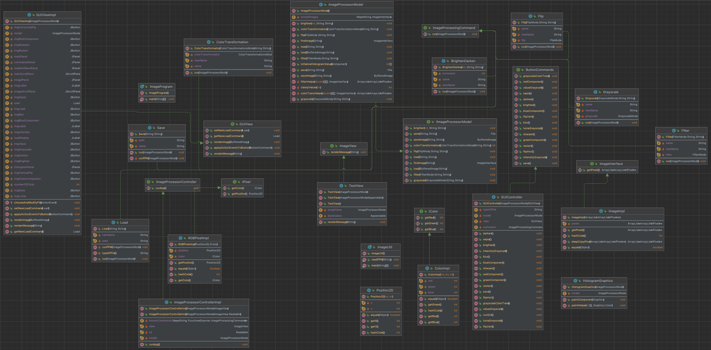

## **DESIGN**

###### [**MODEL**]: The model controls the logic of the ImageProcessor.

##### _[**IMAGES**] - The Images contain all representations of an image broken down into its pixels and colors._

* **IColor** - Color interface representing the RGB color of a pixel, including three rgb getter methods.

* **ColorImpl** - Color class implementation that represents the color as rgb values as integer values that range from 0-255. Implements IColor.

* **IPixel** - Pixel interface that represents a pixel of an image. Holds a method to retrieve the position of the pixel and the color of the pixel.

* **RGBPixelImpl** - Pixel class implementation that represents an RGB pixel.

* **Position 2D** - Position class that represents (x,y) cartesian coordinates.

* **ImageInterface** - Image interface that represents the image of pixels as a 2D arraylist. Holds the method getPixels to return the 2d arraylist.

* **ImageImpl** - Implementation of an image of pixels. Implements ImageInterface.

* **IImageProcessorModel** - An interface that holds all the functionality of the model. Includes all methods that load, save, and alter an image based on our representations of pixels and images.

* **ImageProcessorModel** - ImageProcessor class that represents the overall model. Contains enums for flip (h, v), grayscale (r,g,b,value,luma,intensity), filter, color transformation, and histogram component methods as well as the methods for every command method: brighten, flip, grayscale, filter, color transformations, load, and save. Contains findImage and clampValues helper methods. Each method stores the modified image into a HashMap that can be taken out of when needed to use.

##### _[**COMMANDS**]: The commands contains the logic and methods such as saving, loading, and modifying images in different ways._

* **ImageProcessingCommand** - ImageProcessingCommand interface to use command design pattern. Holds method to run the given commands with the model.

* **BrightenDarken** - Command method that brightens an image by adding a constant and darkening by subtracting a positive constant. Implements ImageProcessingCommand.

* **Flip** - Command method that flips a given image horizontally or vertically. Implements ImageProcessingCommand.

* **Grayscale** - Command method that performs a grayscale effect on an image by changing all the rgb values to the same color. Implements ImageProcessingCommand.

* **Load** - Command method that loads the desired image to another image. Implements ImageProcessingCommand.

* **Save** - Command method that saves the desired image to another image. Implements ImageProcessingCommand.
* **Filter** - Command method that blurs or sharpens the desired image to another image through a filter. Implements ImageProcessingCommand.
* **ColorTransformation** - Command method that transforms the RGB components of an image to create a grayscale or sepia transformation. Applies a matrix of values to the given image. Implements ImageProcessingCommand.
* **Downscale** - Command method that changes the dimensions of the image(1/3 of the original height and 1/2 of the original width).

###### [**VIEW**]: The view prints out the messages, drawings, or an image to the users.
* **ImageView** - View interface that holds the renderMessage method.
* **TextView** - View class for the ImageProcessor to give feedback to users on what commands they have. Executes renderMessage method.
* **GUIView** - View interface for a GUI version of our application. The user gets to press buttons to display and modify their chosen image. Has methods that render messages, images, and sets actions to the buttons.
* **GUIViewImpl** - Implements the GUIView. Initializes the GUI visuals and functionality (choosing an image, modifying an image, displaying the image's RGB and intensity components).
* **HistogramGraphics** - Extends JComponent to override the paintComponent(Graphics g) method. Draws the histogram by extracting values initialized through the initializeHistogramValues(Component comp) method in the model.
 
###### [**CONTROLLER**]: The controller contains a model and a view. It gives the user a way to interact with the model and use the view to display the messages in the model.
* **ImageProcessorController** - Controller interface that contains a model and a view. Holds the method that runs the controller.
* **ImageProcessorControllerImpl** - Controller class that reads text inputs from Readable and writes string outputs. Uses command design pattern to execute command methods. Executes the run method that starts running the text- based controller. Implements ImageProcessorController.
* **ButtonCommands** - GUI controller interface that contains methods for the GUI's buttons (save, restart, and all the modification options).
* **GUIController** - GUI controller class that implements ButtonCommands. When a button is clicked, the model is modified (through the run(ImageProcessorModel m) method) and an image is rendered to the GUI panel in GUIView.
* **ImageProgram** - The program that runs the main method of our application. Has three different possible arguments: "-file -txtFile" (parses through a given text file and then quits), "-text" (interactive script-command), and no arguments (opens GUI).

## **DESIGN CHANGES**

ASSIGNMENT 5 -
1. We added an interface, IImageProcessorModel, that the ImageProcessorModel would implement to allow us to track our methods easier. 
2. There is a separate directory, imagesTest, where all the images created from testing are saved to.
3. There is another directory, images, where all the images created from running the program and providing commands can be saved --> just to give the users some direction.
4. The Load and Save classes in package.model.commands have changed to have private methods that only run when ppm files are loaded and saved. The overridden run(ImageProcessorModel model) method calls the model's new methods, load(BufferedImage image, String newFileName) and saveImage(String pathName, String name), to cater to non-ppm files while loading and saving images, respectively.

ASSIGNMENT 6 -
1. We added a method, initializeHistogramValues(Component comp), in the ImageProcessorModel class to extract RGB and Intensity values from a loaded image. This would allow the histogram in the GUI to access the values it will display when the user picks an image.
2. There is a new interface in the view package, GUIView, that includes all the methods to successfully create a GUI version of our application (rendering images, messages, drawings, etc.).
3. There are two new classes in the view package, GUIViewImpl and HistogramGraphics to help create the GUI.
    1. HistogramGraphics draws the histogram by extending JComponent, overriding its paintComponent(Graphic g) method. Draws four sets of 256 bars, each representing R, G, B, and intensity values of an image. Utilizes the new method in ImageProcessorModel.
    2. GUIViewImpl implements the methods in GUIView but also creates the GUI visuals when called. Crucial to creating the GUI.
4. The new ButtonCommands interface has all the methods that will be applied to their corresponding buttons in the GUI. Allows the buttons to communicate with the model and view.
5. The new GUIController class implements the ButtonCommands interface and draws a connection between the buttons, the view, and the model. When a button is pressed, the model is called to create the change in the image and the modified image is displayed to the user.
6. The GUIController is called in the GUIViewImpl class because the model changes every time a button is pressed, meaning that the controller has to be called every time the user loads an image. Therefore, in order to create this loop, instead of putting the GUIController in the main method, we placed it in the view. Ultimately, the main method calls the GUIViewImpl to create the GUI, and the GUI controller is only ran once the user loads an image.

ASSIGNMENT 6 EXTRA CREDIT PART 1 -
1. We added a new method, downscale(int heightNew, int widthNew, String name, String modifiedImage), in the ImageProcessorModel class and corresponding interface to cater to Extra Credit Part 1: Downscaling an image. It takes in a new height and width of an image and changes the dimensions of the image the user wants to change. This method can be accessed in both script-commands and the GUI.
2. Along with the new method, we added a new Downscale class in package controller.commands so that it would have the ability to access and change what the model does. This is explicitly called when the user types in a command or when the Downscale JButton is pressed in the GUI.
3. To make sure the downscale implementation can be accessible in the GUI, we created a JButton that connected to the downscale() method in ButtonCommands (adds an ActionEvent to the button through the controller --> when runGUI is called).

## **CLASS DIAGRAM**

Screenshot provided in files (**res/DIAGRAM.png**).

## **COMMAND SCRIPTS AND GUI**

Please read our **USEME file** for more detailed information on command scripts and how to use our GUI.

## IMAGE CITATION

All files representing a 3x3 pixel image in res folder were created and are owned by Harriel Patilano! 
She has authorized the use of the pictures and image files for this project.

exampleImg.bmp (800 x 600) in the root submission folder is owned by @ssjtoma on freeimages.com ([https://www.freeimages.com/photo/abstract-series-13-1529920](https://www.freeimages.com/photo/abstract-series-13-1529920))
