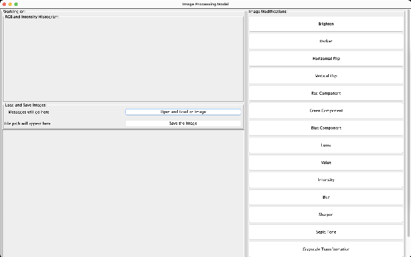
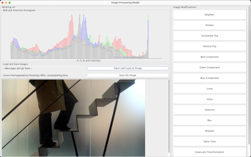
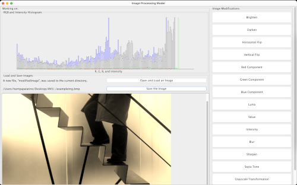

# _~~~~ GUI AND SCRIPT COMMAND INSTRUCTIONS ~~~~_

###### _STEP ZERO: JAR FILE_
###### To run the JAR application, open a terminal, navigate to the folder containing the JAR file and enter: 
* ###### TO UTILIZE THE PROVIDED SCRIPT.TXT FILE: "java -jar 4N5.jar "-file" "script.txt" ". All the commands should run correctly and all the resulting saved, modified images will be located in the res/ folder.
* ###### TO UTILIZE THE PROVIDED SCRIPT.TXT FILE: "java -jar 4N5.jar "-text" ". You should be able to use the interactive script commands (follow the instructions below).
* ###### TO OPEN THE GUI: "java -jar 4N5.jar" or simply double-click on the JAR file and follow the instructions below.

# **HOW TO USE OUR GUI:**

* Run the program, it should lead you to this screen: 
* Load an image clicking on the "Open and Load an Image" button, it will lead you to a file chooser. We have provided a sample image (exampleImg.bmp) but you can use any other image you want. 
* Once you have selected an image, it should be displayed on the right-hand section of the "Working on: " panel, along with the corresponding histogram and its absolute file path. It should look similar to this: 
* Click any of the image modifications to your liking. 
* Once you are satisfied with the image, press the "Save the Image" button and the modified image will be saved in the directory where you opened the program. The display should look similar to this: 
* If you press "Open and Load an Image" more than once, you will receive a pop-up error message. 
* There is a "Restart" button at the bottom if you want to load/modify a different image.

##### What do the Image Modification buttons do?
* Brighten/Darken --> brightens or darkens the image
* Horizontal/Vertical Flip --> flips an image over a horizontal or vertical axis
* Red/Green/Blue Component --> grayscale an image based on RGB component
* Luma/Value/Intensity --> transforms the image's color composition based on luma, value, or intensity
* Blur/Sharpen --> blurs or sharpens the image
* Sepia Tone --> transforms the image's color composition to sepia tone
* Grayscale Transformation --> transforms the image's color composition to grayscale
* Downscale --> changes the dimensions of your image to a third of the original height and half of the original width.
# **HOW TO USE OUR SCRIPT COMMANDS:**

## _**Caution**!_ 

###### _--> Make sure you ALWAYS load an image before trying to save or alter an image. They can be of any file type. You do not need to modify a loaded image to save it._

###### _--> You can use multiple modification commands on an image after you load it._

###### _--> Any new commands after the initial command that has a "-" should be your own input based on the images you want to load, alter, and save. For example, "file-source-path" could be "res/image.ppm" and "new-name" could be "img"._ 

###### _--> "new-name" represents a temporary name you want to call your image after you have loaded or altered it. This name is referred to in future commands._

### **[STEP ONE] :** Load

_Load an image by using the command in the configurations:_
"load file-source-path new-name"

_PROVIDED STARTER FILE PATHS(original, unchanged images):_

* PPM FILE: res/pixelImg.ppm
* BMP FILE: res/pixelImgBMP.bmp
* PNG FILE: res/pixelImgPNG.png
* JPG FILE: res/pixelJPG.jpg
* You can definitely add your own files as well!

### **[STEP TWO] : Altering An Image**

_[Brighten or Darken an Image]_

* "brighten positive-integer name-from-most-recent-command new-name"
* "darken positive-integer name-from-most-recent-command new-name"

_[Greyscale an Image Through RGB Components]_

* RED component: "greyscale-red name-from-most-recent-command new-name"
* BLUE component: "greyscale-blue name-from-most-recent-command new-name"
* GREEN component: "greyscale-green name-from-most-recent-command new-name"

_[Greyscale an Image Through Luma, Value, or Intensity]_

* Luma: "luma name-from-most-recent-command new-name"
* Value: "value name-from-most-recent-command new-name"
* Intensity: "intensity name-from-most-recent-command new-name"

_[Filter: Blur or Sharpen an Image]_

* Blur: "blur name-from-most-recent-command new-name"
* Sharpen: "sharpen name-from-most-recent-command new-name"

_[Color Transformation: Apply Sepia Tone or Grayscale-Transformation to an Image]_

* Sepia: "sepia name-from-most-recent-command new-name"
* Grayscale-Transformation: "grayscale-transformation name-from-most-recent-command new-name"

_[Downscale: Change dimensions of an Image]_

* "downscale new-height new-width name-from-most-recent-command new-name"

### **[STEP THREE] :** Save

Save an image with this command: "save new-file-source-path name-from-most-recent-command"

_There is an "images/" directory in this code, so you can save your files to that path if you want!_